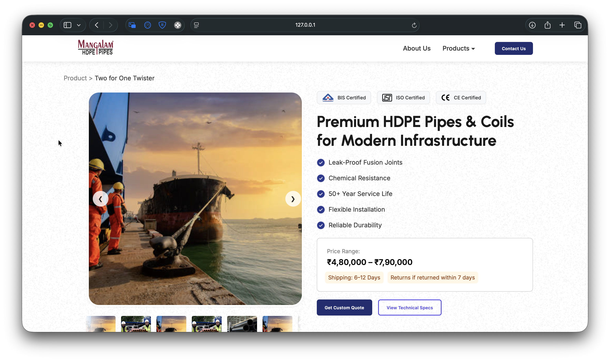

# Mangalam HDPE Pipes Website



A modern, responsive website for Mangalam HDPE Pipes showcasing their premium piping solutions with interactive features.

## Features

- **Product Showcase**: Interactive image carousel with zoom functionality
- **Technical Specifications**: Detailed specs table with downloadable datasheets
- **FAQ Section**: Interactive accordion-style questions and answers
- **Manufacturing Process**: Step-by-step process visualization
- **Responsive Design**: Works on all device sizes
- **Contact Forms**: Modal-based contact and quote request forms

## Technologies Used

- HTML5
- CSS3 (with Flexbox and Grid)
- JavaScript (for interactive elements)
- Google Fonts (Urbanist and Inter)
- Responsive design principles

## Setup

1. Clone the repository:
```bash
git clone https://sahil-bhoite.github.io/Gushwork/
```

2. Open `index.html` in your browser

## Live Demo

[View the live website at:  
- Live demo: [https://sahil-bhoite.github.io/Gushwork/ ](https://sahil-bhoite.github.io/Gushwork/)

## Author

**Sahil Bhoite**  
- GitHub: [@sahil-bhoite](https://github.com/sahil-bhoite)
- My Website: [sahil-bhoite.github.io/Website/](sahil-bhoite.github.io/Website/)

## Project Structure

```
/
├── index.html          # Main HTML file
├── new-style.css       # All CSS styles
├── script.js           # All JavaScript functionality
├── README.md           # This file
└── assets/             # All images and icons
    ├── app1.png
    ├── app2.png
    ├── ...
    └── tick.png
```

